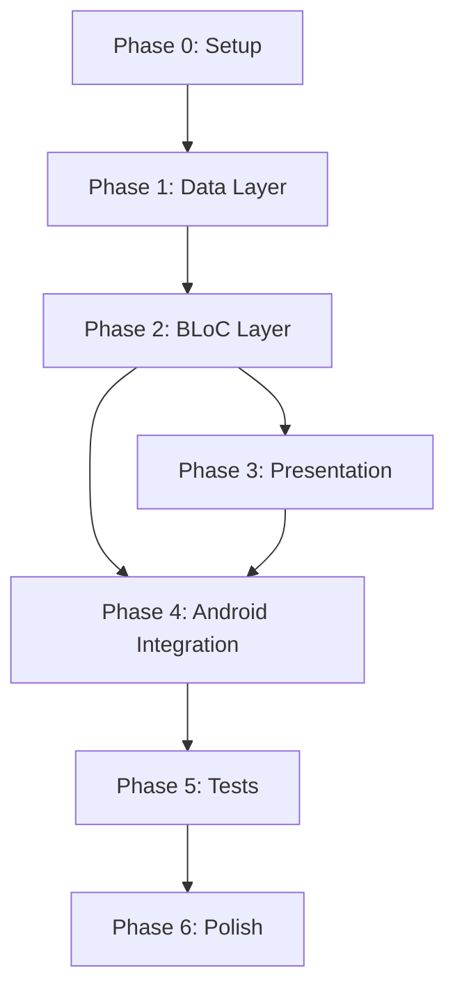

# Mobile-Share Implementation Plan
**Date:** 2025-10-23
**Design Reference:** [2025-10-23-mobile-share-design.md](./2025-10-23-mobile-share-design.md)
**Status:** Ready for implementation

---

## Table des matières
1. [Vue d'ensemble](#vue-densemble)
2. [Phases d'implémentation](#phases-dimplémentation)
3. [Phase 0: Setup projet](#phase-0-setup-projet)
4. [Phase 1: Data Layer](#phase-1-data-layer)
5. [Phase 2: BLoC Layer](#phase-2-bloc-layer)
6. [Phase 3: Presentation Layer](#phase-3-presentation-layer)
7. [Phase 4: Intégration Android](#phase-4-intégration-android)
8. [Phase 5: Tests et validation](#phase-5-tests-et-validation)
9. [Phase 6: Polish et optimisations](#phase-6-polish-et-optimisations)
10. [Points de validation](#points-de-validation)

---

## Vue d'ensemble

### Approche d'implémentation
- **Bottom-up** : Commencer par les fondations (data layer) avant l'UI
- **Incrémental** : Chaque phase livre une fonctionnalité testable
- **Test-driven** : Tests unitaires pour repositories et BLoCs

### Ordre des phases
```
Phase 0: Setup projet (1-2h)
    ↓
Phase 1: Data Layer (4-6h)
    ↓
Phase 2: BLoC Layer (6-8h)
    ↓
Phase 3: Presentation Layer (8-10h)
    ↓
Phase 4: Intégration Android (2-3h)
    ↓
Phase 5: Tests et validation (4-5h)
    ↓
Phase 6: Polish et optimisations (2-3h)
```

**Estimation totale : 27-37 heures**

### Organisation du code
```
lib/
├── main.dart
├── app.dart
├── core/
│   ├── constants/
│   ├── theme/
│   └── utils/
├── data/
│   ├── models/
│   ├── repositories/
│   └── datasources/
├── domain/
│   └── entities/
├── presentation/
│   ├── blocs/
│   ├── screens/
│   └── widgets/
└── services/
```

---

## Phase 0: Setup projet

**Objectif** : Initialiser le projet Flutter avec toutes les dépendances nécessaires

**Durée estimée** : 1-2 heures

### Task 0.1: Créer le projet Flutter

**Commande** :
```bash
flutter create mobile_share
cd mobile_share
```

**Checklist** :
- [ ] Projet Flutter créé avec succès
- [ ] `flutter run` fonctionne (app Hello World)
- [ ] Git initialisé (déjà fait dans veille/mobile-share/)
- [ ] .gitignore configuré (déjà fait)

**Fichiers créés** :
- Structure projet Flutter standard

---

### Task 0.2: Configurer pubspec.yaml

**Fichier** : `pubspec.yaml`

**Dépendances à ajouter** :
```yaml
dependencies:
  flutter:
    sdk: flutter

  # State Management
  flutter_bloc: ^8.1.3
  equatable: ^2.0.5

  # Storage
  sqflite: ^2.3.0
  flutter_secure_storage: ^9.0.0
  path_provider: ^2.1.1

  # Network
  http: ^1.1.0
  connectivity_plus: ^5.0.1

  # Utils
  url_launcher: ^6.2.1
  intl: ^0.18.1

dev_dependencies:
  flutter_test:
    sdk: flutter
  flutter_lints: ^3.0.0
  bloc_test: ^9.1.5
  mockito: ^5.4.4
  build_runner: ^2.4.7
```

**Checklist** :
- [ ] Dépendances ajoutées à pubspec.yaml
- [ ] `flutter pub get` exécuté avec succès
- [ ] Aucune erreur de dépendances
- [ ] Versions compatibles vérifiées

**Critères d'acceptance** :
- ✅ `flutter pub get` réussit sans warnings
- ✅ Toutes les dépendances résolues

---

### Task 0.3: Structure des dossiers

**Commandes** :
```bash
mkdir -p lib/core/{constants,theme,utils}
mkdir -p lib/data/{models,repositories,datasources}
mkdir -p lib/domain/entities
mkdir -p lib/presentation/{blocs,screens,widgets}
mkdir -p lib/services
mkdir -p test/{unit,widget,integration}
```

**Checklist** :
- [ ] Tous les dossiers créés
- [ ] Structure cohérente avec le design
- [ ] Dossier test/ configuré

**Fichiers créés** :
- Arborescence complète du projet

---

### Task 0.4: Configuration de base (constants, theme)

**Fichiers à créer** :

**`lib/core/constants/app_constants.dart`** :
```dart
class AppConstants {
  // GitHub OAuth
  static const String githubClientId = 'YOUR_CLIENT_ID'; // À configurer via env
  static const String githubOAuthUrl = 'https://github.com/login/oauth/authorize';
  static const String githubTokenUrl = 'https://github.com/login/oauth/access_token';
  static const String githubApiBaseUrl = 'https://api.github.com';

  // App
  static const String appName = 'Mobile-Share';
  static const String deepLinkScheme = 'mobileshare';
  static const String oauthCallbackPath = 'oauth-callback';

  // Files
  static const String targetFileName = 'urls-to-process.md';

  // Storage keys
  static const String keyGithubToken = 'github_token';
  static const String keyGithubUsername = 'github_username';
  static const String keyGithubRepo = 'github_repo';
  static const String keyGithubBranch = 'github_branch';
  static const String keyTokenType = 'token_type';
}
```

**`lib/core/theme/app_theme.dart`** :
```dart
import 'package:flutter/material.dart';

class AppTheme {
  // Colors
  static const Color primaryColor = Color(0xFF2196F3);
  static const Color secondaryColor = Color(0xFF4CAF50);
  static const Color accentColor = Color(0xFFFF9800);
  static const Color errorColor = Color(0xFFF44336);
  static const Color backgroundColor = Color(0xFFFFFFFF);
  static const Color surfaceColor = Color(0xFFF5F5F5);
  static const Color textPrimary = Color(0xFF212121);
  static const Color textSecondary = Color(0xFF757575);

  static ThemeData get lightTheme {
    return ThemeData(
      primaryColor: primaryColor,
      scaffoldBackgroundColor: backgroundColor,
      colorScheme: ColorScheme.light(
        primary: primaryColor,
        secondary: secondaryColor,
        error: errorColor,
        surface: surfaceColor,
      ),
      textTheme: const TextTheme(
        headlineLarge: TextStyle(
          fontSize: 24,
          fontWeight: FontWeight.bold,
          color: textPrimary,
        ),
        headlineMedium: TextStyle(
          fontSize: 20,
          fontWeight: FontWeight.w500,
          color: textPrimary,
        ),
        bodyLarge: TextStyle(
          fontSize: 16,
          fontWeight: FontWeight.normal,
          color: textPrimary,
        ),
        bodyMedium: TextStyle(
          fontSize: 14,
          fontWeight: FontWeight.normal,
          color: textPrimary,
        ),
        bodySmall: TextStyle(
          fontSize: 12,
          fontWeight: FontWeight.normal,
          color: textSecondary,
        ),
      ),
      elevatedButtonTheme: ElevatedButtonThemeData(
        style: ElevatedButton.styleFrom(
          backgroundColor: primaryColor,
          foregroundColor: Colors.white,
          textStyle: const TextStyle(
            fontSize: 14,
            fontWeight: FontWeight.w500,
          ),
          shape: RoundedRectangleBorder(
            borderRadius: BorderRadius.circular(8),
          ),
          padding: const EdgeInsets.symmetric(horizontal: 24, vertical: 12),
        ),
      ),
      inputDecorationTheme: InputDecorationTheme(
        border: OutlineInputBorder(
          borderRadius: BorderRadius.circular(8),
          borderSide: BorderSide(color: textSecondary.withOpacity(0.3)),
        ),
        focusedBorder: OutlineInputBorder(
          borderRadius: BorderRadius.circular(8),
          borderSide: const BorderSide(color: primaryColor, width: 2),
        ),
        contentPadding: const EdgeInsets.symmetric(horizontal: 16, vertical: 12),
      ),
      cardTheme: CardTheme(
        elevation: 2,
        shape: RoundedRectangleBorder(
          borderRadius: BorderRadius.circular(8),
        ),
        margin: const EdgeInsets.symmetric(horizontal: 16, vertical: 8),
      ),
      floatingActionButtonTheme: const FloatingActionButtonThemeData(
        backgroundColor: primaryColor,
        foregroundColor: Colors.white,
        elevation: 6,
      ),
    );
  }
}
```

**Checklist** :
- [ ] AppConstants créé avec toutes les constantes
- [ ] AppTheme créé avec couleurs du design
- [ ] Thème testé dans main.dart

**Critères d'acceptance** :
- ✅ Constantes accessibles depuis toute l'app
- ✅ Thème appliqué correctement

---

### Task 0.5: App entry point

**Fichier** : `lib/main.dart`

```dart
import 'package:flutter/material.dart';
import 'package:flutter_bloc/flutter_bloc.dart';
import 'app.dart';
import 'core/theme/app_theme.dart';

void main() async {
  WidgetsFlutterBinding.ensureInitialized();

  // TODO: Initialize dependencies (repositories, BLoCs)

  runApp(const MobileShareApp());
}

class MobileShareApp extends StatelessWidget {
  const MobileShareApp({Key? key}) : super(key: key);

  @override
  Widget build(BuildContext context) {
    return MaterialApp(
      title: 'Mobile-Share',
      theme: AppTheme.lightTheme,
      home: const Scaffold(
        body: Center(
          child: Text('Mobile-Share - Setup Complete'),
        ),
      ),
    );
  }
}
```

**Checklist** :
- [ ] main.dart créé
- [ ] App lance sans erreurs
- [ ] Thème appliqué

**Point de validation** :
- ✅ **V0** : App Flutter fonctionne avec structure et thème de base

---

## Phase 1: Data Layer

**Objectif** : Implémenter tous les repositories, models et datasources

**Durée estimée** : 4-6 heures

**Dépendances** : Phase 0 complétée

---

### Task 1.1: Créer les modèles de données

**Fichiers à créer** :

**`lib/data/models/pending_url.dart`** :
```dart
import 'package:equatable/equatable.dart';

class PendingUrl extends Equatable {
  final int? id;
  final String url;
  final DateTime timestamp;
  final bool synced;

  const PendingUrl({
    this.id,
    required this.url,
    required this.timestamp,
    this.synced = false,
  });

  // toMap for SQLite
  Map<String, dynamic> toMap() {
    return {
      'id': id,
      'url': url,
      'timestamp': timestamp.millisecondsSinceEpoch,
      'synced': synced ? 1 : 0,
    };
  }

  // fromMap for SQLite
  factory PendingUrl.fromMap(Map<String, dynamic> map) {
    return PendingUrl(
      id: map['id'] as int?,
      url: map['url'] as String,
      timestamp: DateTime.fromMillisecondsSinceEpoch(map['timestamp'] as int),
      synced: (map['synced'] as int) == 1,
    );
  }

  // copyWith for immutability
  PendingUrl copyWith({
    int? id,
    String? url,
    DateTime? timestamp,
    bool? synced,
  }) {
    return PendingUrl(
      id: id ?? this.id,
      url: url ?? this.url,
      timestamp: timestamp ?? this.timestamp,
      synced: synced ?? this.synced,
    );
  }

  @override
  List<Object?> get props => [id, url, timestamp, synced];
}
```

**`lib/data/models/github_config.dart`** :
```dart
import 'package:equatable/equatable.dart';

class GitHubConfig extends Equatable {
  final String username;
  final String repository;
  final String branch;

  const GitHubConfig({
    required this.username,
    required this.repository,
    this.branch = 'main',
  });

  bool get isValid =>
      username.isNotEmpty && repository.isNotEmpty && branch.isNotEmpty;

  Map<String, dynamic> toMap() {
    return {
      'username': username,
      'repository': repository,
      'branch': branch,
    };
  }

  factory GitHubConfig.fromMap(Map<String, dynamic> map) {
    return GitHubConfig(
      username: map['username'] as String,
      repository: map['repository'] as String,
      branch: map['branch'] as String? ?? 'main',
    );
  }

  @override
  List<Object?> get props => [username, repository, branch];
}
```

**`lib/data/models/auth_token.dart`** :
```dart
import 'package:equatable/equatable.dart';

enum TokenType { oauth, pat }

class AuthToken extends Equatable {
  final String token;
  final TokenType type;
  final DateTime? expiresAt;

  const AuthToken({
    required this.token,
    required this.type,
    this.expiresAt,
  });

  bool get isExpired {
    if (expiresAt == null) return false;
    return DateTime.now().isAfter(expiresAt!);
  }

  Map<String, dynamic> toMap() {
    return {
      'token': token,
      'type': type.name,
      'expiresAt': expiresAt?.toIso8601String(),
    };
  }

  factory AuthToken.fromMap(Map<String, dynamic> map) {
    return AuthToken(
      token: map['token'] as String,
      type: TokenType.values.firstWhere((e) => e.name == map['type']),
      expiresAt: map['expiresAt'] != null
          ? DateTime.parse(map['expiresAt'] as String)
          : null,
    );
  }

  @override
  List<Object?> get props => [token, type, expiresAt];
}
```

**Checklist** :
- [ ] PendingUrl créé avec toMap/fromMap
- [ ] GitHubConfig créé avec validation
- [ ] AuthToken créé avec gestion expiration
- [ ] Tests unitaires pour chaque modèle

**Tests à créer** : `test/unit/data/models/`
- [ ] `pending_url_test.dart`
- [ ] `github_config_test.dart`
- [ ] `auth_token_test.dart`

**Critères d'acceptance** :
- ✅ Tous les modèles sérialisent/désérialisent correctement
- ✅ Tests unitaires passent

---

### Task 1.2: SQLite Database Service

**Fichier** : `lib/data/datasources/local_database.dart`

```dart
import 'package:sqflite/sqflite.dart';
import 'package:path/path.dart';
import '../models/pending_url.dart';

class LocalDatabase {
  static final LocalDatabase _instance = LocalDatabase._internal();
  factory LocalDatabase() => _instance;
  LocalDatabase._internal();

  static Database? _database;

  Future<Database> get database async {
    if (_database != null) return _database!;
    _database = await _initDatabase();
    return _database!;
  }

  Future<Database> _initDatabase() async {
    final dbPath = await getDatabasesPath();
    final path = join(dbPath, 'mobile_share.db');

    return await openDatabase(
      path,
      version: 1,
      onCreate: _onCreate,
    );
  }

  Future<void> _onCreate(Database db, int version) async {
    await db.execute('''
      CREATE TABLE pending_urls (
        id INTEGER PRIMARY KEY AUTOINCREMENT,
        url TEXT NOT NULL UNIQUE,
        timestamp INTEGER NOT NULL,
        synced INTEGER NOT NULL DEFAULT 0
      )
    ''');

    await db.execute('''
      CREATE INDEX idx_synced ON pending_urls(synced)
    ''');

    await db.execute('''
      CREATE INDEX idx_timestamp ON pending_urls(timestamp DESC)
    ''');
  }

  Future<void> close() async {
    final db = await database;
    await db.close();
  }
}
```

**Checklist** :
- [ ] LocalDatabase singleton créé
- [ ] Schema SQLite défini
- [ ] Indexes créés
- [ ] Migration v1 testée

**Critères d'acceptance** :
- ✅ Database s'initialise correctement
- ✅ Tables et indexes créés

---

### Task 1.3: LocalUrlRepository

**Fichier** : `lib/data/repositories/local_url_repository.dart`

```dart
import 'package:sqflite/sqflite.dart';
import '../datasources/local_database.dart';
import '../models/pending_url.dart';

class LocalUrlRepository {
  final LocalDatabase _db = LocalDatabase();

  Future<int> addUrl(PendingUrl url) async {
    final db = await _db.database;
    return await db.insert(
      'pending_urls',
      url.toMap(),
      conflictAlgorithm: ConflictAlgorithm.ignore,
    );
  }

  Future<bool> exists(String url) async {
    final db = await _db.database;
    final result = await db.query(
      'pending_urls',
      where: 'url = ?',
      whereArgs: [url],
    );
    return result.isNotEmpty;
  }

  Future<List<PendingUrl>> getAll() async {
    final db = await _db.database;
    final result = await db.query(
      'pending_urls',
      orderBy: 'timestamp DESC',
    );
    return result.map((map) => PendingUrl.fromMap(map)).toList();
  }

  Future<List<PendingUrl>> getUnsynced() async {
    final db = await _db.database;
    final result = await db.query(
      'pending_urls',
      where: 'synced = ?',
      whereArgs: [0],
      orderBy: 'timestamp ASC',
    );
    return result.map((map) => PendingUrl.fromMap(map)).toList();
  }

  Future<int> markAsSynced(List<int> ids) async {
    final db = await _db.database;
    return await db.update(
      'pending_urls',
      {'synced': 1},
      where: 'id IN (${ids.join(',')})',
    );
  }

  Future<int> delete(int id) async {
    final db = await _db.database;
    return await db.delete(
      'pending_urls',
      where: 'id = ?',
      whereArgs: [id],
    );
  }

  Future<int> count() async {
    final db = await _db.database;
    final result = await db.rawQuery('SELECT COUNT(*) FROM pending_urls');
    return Sqflite.firstIntValue(result) ?? 0;
  }
}
```

**Checklist** :
- [ ] Toutes les méthodes CRUD implémentées
- [ ] exists() pour détection doublons
- [ ] getUnsynced() pour sync
- [ ] Tests unitaires avec mock database

**Tests** : `test/unit/data/repositories/local_url_repository_test.dart`

**Critères d'acceptance** :
- ✅ CRUD fonctionne
- ✅ Détection doublons correcte
- ✅ Tests passent

---

### Task 1.4: SettingsRepository

**Fichier** : `lib/data/repositories/settings_repository.dart`

```dart
import 'package:flutter_secure_storage/flutter_secure_storage.dart';
import 'dart:convert';
import '../models/github_config.dart';
import '../models/auth_token.dart';
import '../../core/constants/app_constants.dart';

class SettingsRepository {
  final FlutterSecureStorage _storage = const FlutterSecureStorage();

  // GitHub Config
  Future<void> saveConfig(GitHubConfig config) async {
    await _storage.write(
      key: AppConstants.keyGithubUsername,
      value: config.username,
    );
    await _storage.write(
      key: AppConstants.keyGithubRepo,
      value: config.repository,
    );
    await _storage.write(
      key: AppConstants.keyGithubBranch,
      value: config.branch,
    );
  }

  Future<GitHubConfig?> loadConfig() async {
    final username = await _storage.read(key: AppConstants.keyGithubUsername);
    final repo = await _storage.read(key: AppConstants.keyGithubRepo);
    final branch = await _storage.read(key: AppConstants.keyGithubBranch);

    if (username == null || repo == null) return null;

    return GitHubConfig(
      username: username,
      repository: repo,
      branch: branch ?? 'main',
    );
  }

  // Auth Token
  Future<void> saveToken(AuthToken token) async {
    final tokenMap = token.toMap();
    await _storage.write(
      key: AppConstants.keyGithubToken,
      value: jsonEncode(tokenMap),
    );
  }

  Future<AuthToken?> loadToken() async {
    final tokenJson = await _storage.read(key: AppConstants.keyGithubToken);
    if (tokenJson == null) return null;

    final tokenMap = jsonDecode(tokenJson) as Map<String, dynamic>;
    return AuthToken.fromMap(tokenMap);
  }

  Future<void> clearToken() async {
    await _storage.delete(key: AppConstants.keyGithubToken);
  }

  Future<void> clearAll() async {
    await _storage.deleteAll();
  }
}
```

**Checklist** :
- [ ] Save/load config implémenté
- [ ] Save/load token avec sécurité
- [ ] clearAll pour logout
- [ ] Tests avec mock storage

**Tests** : `test/unit/data/repositories/settings_repository_test.dart`

**Critères d'acceptance** :
- ✅ Config et token stockés de manière sécurisée
- ✅ Tests passent

---

### Task 1.5: GitHubRepository

**Fichier** : `lib/data/repositories/github_repository.dart`

```dart
import 'dart:convert';
import 'package:http/http.dart' as http;
import '../models/github_config.dart';
import '../models/auth_token.dart';
import '../../core/constants/app_constants.dart';

class GitHubRepository {
  final http.Client _client;

  GitHubRepository({http.Client? client}) : _client = client ?? http.Client();

  Future<String?> getFileContent(
    GitHubConfig config,
    AuthToken token,
    String fileName,
  ) async {
    final url = Uri.parse(
      '${AppConstants.githubApiBaseUrl}/repos/${config.username}/${config.repository}/contents/$fileName?ref=${config.branch}',
    );

    final response = await _client.get(
      url,
      headers: {
        'Authorization': 'Bearer ${token.token}',
        'Accept': 'application/vnd.github.v3+json',
      },
    );

    if (response.statusCode == 404) {
      return null; // File doesn't exist
    }

    if (response.statusCode != 200) {
      throw Exception('Failed to fetch file: ${response.statusCode}');
    }

    final data = jsonDecode(response.body);
    final contentBase64 = data['content'] as String;
    final content = utf8.decode(base64.decode(contentBase64.replaceAll('\n', '')));

    return content;
  }

  Future<String?> getFileSha(
    GitHubConfig config,
    AuthToken token,
    String fileName,
  ) async {
    final url = Uri.parse(
      '${AppConstants.githubApiBaseUrl}/repos/${config.username}/${config.repository}/contents/$fileName?ref=${config.branch}',
    );

    final response = await _client.get(
      url,
      headers: {
        'Authorization': 'Bearer ${token.token}',
        'Accept': 'application/vnd.github.v3+json',
      },
    );

    if (response.statusCode == 404) return null;
    if (response.statusCode != 200) {
      throw Exception('Failed to fetch file SHA: ${response.statusCode}');
    }

    final data = jsonDecode(response.body);
    return data['sha'] as String;
  }

  Future<List<String>> checkDuplicates(
    GitHubConfig config,
    AuthToken token,
    List<String> urls,
  ) async {
    final content = await getFileContent(
      config,
      token,
      AppConstants.targetFileName,
    );

    if (content == null) return urls; // File doesn't exist, no duplicates

    final existingUrls = content.split('\n').where((line) => line.trim().isNotEmpty).toSet();

    return urls.where((url) => !existingUrls.contains(url)).toList();
  }

  Future<void> appendUrls(
    GitHubConfig config,
    AuthToken token,
    List<String> urls,
  ) async {
    if (urls.isEmpty) return;

    // Get current content and SHA
    final currentContent = await getFileContent(
      config,
      token,
      AppConstants.targetFileName,
    );
    final sha = await getFileSha(
      config,
      token,
      AppConstants.targetFileName,
    );

    // Build new content
    final newContent = currentContent != null
        ? '$currentContent\n${urls.join('\n')}\n'
        : '${urls.join('\n')}\n';

    final contentBase64 = base64.encode(utf8.encode(newContent));

    // Update file
    final url = Uri.parse(
      '${AppConstants.githubApiBaseUrl}/repos/${config.username}/${config.repository}/contents/${AppConstants.targetFileName}',
    );

    final body = jsonEncode({
      'message': 'Add URLs from mobile-share [${DateTime.now().toIso8601String()}]',
      'content': contentBase64,
      'branch': config.branch,
      if (sha != null) 'sha': sha,
    });

    final response = await _client.put(
      url,
      headers: {
        'Authorization': 'Bearer ${token.token}',
        'Accept': 'application/vnd.github.v3+json',
        'Content-Type': 'application/json',
      },
      body: body,
    );

    if (response.statusCode != 200 && response.statusCode != 201) {
      throw Exception('Failed to update file: ${response.statusCode} ${response.body}');
    }
  }

  Future<Map<String, dynamic>> getUserInfo(AuthToken token) async {
    final url = Uri.parse('${AppConstants.githubApiBaseUrl}/user');

    final response = await _client.get(
      url,
      headers: {
        'Authorization': 'Bearer ${token.token}',
        'Accept': 'application/vnd.github.v3+json',
      },
    );

    if (response.statusCode != 200) {
      throw Exception('Failed to get user info: ${response.statusCode}');
    }

    return jsonDecode(response.body) as Map<String, dynamic>;
  }
}
```

**Checklist** :
- [ ] getFileContent implémenté
- [ ] getFileSha pour updates
- [ ] checkDuplicates fonctionnel
- [ ] appendUrls avec gestion SHA
- [ ] getUserInfo pour display username
- [ ] Gestion erreurs HTTP (401, 404, 5xx)
- [ ] Tests avec mock HTTP client

**Tests** : `test/unit/data/repositories/github_repository_test.dart`

**Critères d'acceptance** :
- ✅ Toutes les opérations GitHub fonctionnent
- ✅ Gestion erreurs correcte
- ✅ Tests passent

**Point de validation** :
- ✅ **V1** : Data layer complet et testé

---

## Phase 2: BLoC Layer

**Objectif** : Implémenter tous les BLoCs avec leurs événements et états

**Durée estimée** : 6-8 heures

**Dépendances** : Phase 1 complétée

---

### Task 2.1: SettingsBLoC

**Fichiers à créer** :

**`lib/presentation/blocs/settings/settings_event.dart`** :
```dart
import 'package:equatable/equatable.dart';
import '../../../data/models/github_config.dart';

abstract class SettingsEvent extends Equatable {
  const SettingsEvent();

  @override
  List<Object?> get props => [];
}

class LoadSettings extends SettingsEvent {}

class SaveSettings extends SettingsEvent {
  final GitHubConfig config;

  const SaveSettings(this.config);

  @override
  List<Object?> get props => [config];
}

class ClearSettings extends SettingsEvent {}
```

**`lib/presentation/blocs/settings/settings_state.dart`** :
```dart
import 'package:equatable/equatable.dart';
import '../../../data/models/github_config.dart';

abstract class SettingsState extends Equatable {
  const SettingsState();

  @override
  List<Object?> get props => [];
}

class SettingsInitial extends SettingsState {}

class SettingsLoading extends SettingsState {}

class SettingsLoaded extends SettingsState {
  final GitHubConfig? config;

  const SettingsLoaded(this.config);

  @override
  List<Object?> get props => [config];
}

class SettingsSaved extends SettingsState {}

class SettingsError extends SettingsState {
  final String message;

  const SettingsError(this.message);

  @override
  List<Object?> get props => [message];
}
```

**`lib/presentation/blocs/settings/settings_bloc.dart`** :
```dart
import 'package:flutter_bloc/flutter_bloc.dart';
import '../../../data/repositories/settings_repository.dart';
import 'settings_event.dart';
import 'settings_state.dart';

class SettingsBloc extends Bloc<SettingsEvent, SettingsState> {
  final SettingsRepository _repository;

  SettingsBloc(this._repository) : super(SettingsInitial()) {
    on<LoadSettings>(_onLoadSettings);
    on<SaveSettings>(_onSaveSettings);
    on<ClearSettings>(_onClearSettings);
  }

  Future<void> _onLoadSettings(
    LoadSettings event,
    Emitter<SettingsState> emit,
  ) async {
    emit(SettingsLoading());
    try {
      final config = await _repository.loadConfig();
      emit(SettingsLoaded(config));
    } catch (e) {
      emit(SettingsError('Failed to load settings: $e'));
    }
  }

  Future<void> _onSaveSettings(
    SaveSettings event,
    Emitter<SettingsState> emit,
  ) async {
    emit(SettingsLoading());
    try {
      await _repository.saveConfig(event.config);
      emit(SettingsSaved());
      emit(SettingsLoaded(event.config));
    } catch (e) {
      emit(SettingsError('Failed to save settings: $e'));
    }
  }

  Future<void> _onClearSettings(
    ClearSettings event,
    Emitter<SettingsState> emit,
  ) async {
    try {
      await _repository.clearAll();
      emit(const SettingsLoaded(null));
    } catch (e) {
      emit(SettingsError('Failed to clear settings: $e'));
    }
  }
}
```

**Checklist** :
- [ ] Events définis
- [ ] States définis
- [ ] BLoC implémenté
- [ ] Tests BLoC avec bloc_test

**Tests** : `test/unit/presentation/blocs/settings_bloc_test.dart`

**Critères d'acceptance** :
- ✅ LoadSettings fonctionne
- ✅ SaveSettings fonctionne
- ✅ Tests passent

---

### Task 2.2: AuthBLoC

**Events, States, BLoC** (structure similaire à SettingsBLoC)

**`lib/presentation/blocs/auth/auth_event.dart`** :
```dart
abstract class AuthEvent extends Equatable {
  const AuthEvent();
  @override
  List<Object?> get props => [];
}

class CheckAuth extends AuthEvent {}
class StartOAuth extends AuthEvent {}
class CompleteOAuth extends AuthEvent {
  final String code;
  const CompleteOAuth(this.code);
  @override
  List<Object?> get props => [code];
}
class UsePAT extends AuthEvent {
  final String token;
  const UsePAT(this.token);
  @override
  List<Object?> get props => [token];
}
class Logout extends AuthEvent {}
```

**States** :
- `AuthInitial`
- `AuthUnauthenticated`
- `AuthInProgress`
- `AuthAuthenticated(username)`
- `AuthError(message)`

**Checklist** :
- [ ] OAuth flow events
- [ ] PAT support events
- [ ] States complets
- [ ] BLoC avec logique OAuth
- [ ] Tests

**Note** : OAuth complet nécessite backend pour exchange code → token (pas inclus dans ce plan, utiliser PAT en priorité)

---

### Task 2.3: UrlBLoC

**`lib/presentation/blocs/url/url_event.dart`** :
```dart
abstract class UrlEvent extends Equatable {
  const UrlEvent();
  @override
  List<Object?> get props => [];
}

class LoadUrls extends UrlEvent {}

class AddUrl extends UrlEvent {
  final String url;
  const AddUrl(this.url);
  @override
  List<Object?> get props => [url];
}

class DeleteUrl extends UrlEvent {
  final int id;
  const DeleteUrl(this.id);
  @override
  List<Object?> get props => [id];
}

class MarkUrlsSynced extends UrlEvent {
  final List<int> ids;
  const MarkUrlsSynced(this.ids);
  @override
  List<Object?> get props => [ids];
}
```

**States** :
- `UrlsInitial`
- `UrlsLoading`
- `UrlsLoaded(List<PendingUrl> urls)`
- `UrlAdded(PendingUrl url)`
- `UrlDeleted(int id)`
- `UrlError(String message)`

**BLoC** : Interaction avec LocalUrlRepository

**Checklist** :
- [ ] Events définis
- [ ] States définis
- [ ] BLoC avec CRUD local
- [ ] Validation URL (regex)
- [ ] Détection doublons
- [ ] Tests

**Critères d'acceptance** :
- ✅ AddUrl valide et détecte doublons
- ✅ CRUD fonctionne
- ✅ Tests passent

---

### Task 2.4: SyncBLoC

**Events** :
- `ManualSync`
- `AutoSync`

**States** :
- `SyncIdle`
- `Syncing(int progress, int total)`
- `SyncSuccess(int synced)`
- `SyncError(String message)`

**BLoC Logic** :
1. Récupère URLs non-synced (LocalUrlRepository)
2. Check duplicates (GitHubRepository)
3. Append to GitHub (GitHubRepository)
4. Mark as synced (LocalUrlRepository via UrlBLoC event)

**Checklist** :
- [ ] Events définis
- [ ] States avec progress
- [ ] Orchestration des repositories
- [ ] Gestion erreurs réseau
- [ ] Tests

**Critères d'acceptance** :
- ✅ Sync complète fonctionne
- ✅ Erreurs gérées correctement
- ✅ URLs marquées synced après succès

**Point de validation** :
- ✅ **V2** : Tous les BLoCs implémentés et testés

---

## Phase 3: Presentation Layer

**Objectif** : Implémenter toutes les UI screens et widgets

**Durée estimée** : 8-10 heures

**Dépendances** : Phase 2 complétée

---

### Task 3.1: SettingsScreen

**Fichier** : `lib/presentation/screens/settings_screen.dart`

**Composants** :
- AppBar avec back button
- Status badge (Connected / Not connected)
- TextFields : Username, Repository, Branch
- Authentication section
  - OAuth button
  - PAT button
  - Disconnect button (si authenticated)
- Save Settings button

**BLoCs utilisés** :
- `SettingsBLoC` : Load/save config
- `AuthBLoC` : Auth status, login/logout

**Checklist** :
- [ ] UI layout conforme au design
- [ ] Form validation
- [ ] BlocBuilder pour status
- [ ] BlocListener pour feedbacks
- [ ] Navigation vers auth flows
- [ ] Tests widgets

**Tests** : `test/widget/screens/settings_screen_test.dart`

**Critères d'acceptance** :
- ✅ UI conforme au mockup
- ✅ Save fonctionne
- ✅ Auth status affiché correctement

---

### Task 3.2: UrlListScreen

**Fichier** : `lib/presentation/screens/url_list_screen.dart`

**Composants** :
- AppBar avec titre + settings icon + refresh icon
- ListView.builder des URLs
- Empty state widget
- FloatingActionButton (sync)
- Sync progress indicator

**Widgets custom** :
- `UrlCard` : Item de liste
- `EmptyState` : État vide
- `SyncProgressCard` : Progress pendant sync

**BLoCs utilisés** :
- `UrlBLoC` : Liste des URLs
- `SyncBLoC` : Sync status et progress

**Checklist** :
- [ ] ListView avec UrlCards
- [ ] Empty state
- [ ] FAB sync visible si URLs locales
- [ ] AppBar avec navigation settings
- [ ] BlocBuilder pour liste
- [ ] BlocListener pour sync feedback
- [ ] Tests widgets

**Tests** : `test/widget/screens/url_list_screen_test.dart`

**Critères d'acceptance** :
- ✅ UI conforme au mockup
- ✅ Liste affiche correctement
- ✅ Sync button fonctionne

---

### Task 3.3: UrlCard Widget

**Fichier** : `lib/presentation/widgets/url_card.dart`

**Composants** :
- URL (cliquable avec url_launcher)
- Badge status (Synced/Local)
- Timestamp formaté
- Delete button
- Swipe to delete (Dismissible)

**Props** :
- `PendingUrl url`
- `VoidCallback onDelete`
- `VoidCallback onTap`

**Checklist** :
- [ ] Card design conforme
- [ ] Badge vert/orange selon status
- [ ] URL cliquable (url_launcher)
- [ ] Delete button + swipe
- [ ] Animation delete
- [ ] Tests widgets

**Critères d'acceptance** :
- ✅ Visuel conforme
- ✅ Interactions fonctionnent

---

### Task 3.4: Widgets utilitaires

**Widgets à créer** :
- `EmptyState` : Icon + text centré
- `SyncProgressCard` : Progress bar avec texte
- `StatusBadge` : Chip coloré synced/local
- `LoadingIndicator` : Spinner standard

**Checklist** :
- [ ] Tous les widgets créés
- [ ] Réutilisables
- [ ] Tests

---

### Task 3.5: Navigation et routing

**Fichier** : `lib/app.dart`

**Routes** :
- `/` : UrlListScreen (si authenticated) ou SettingsScreen (si non-authenticated)
- `/settings` : SettingsScreen

**Navigation logic** :
- Si AuthBLoC.state = Unauthenticated → Redirect settings
- Sinon → UrlListScreen

**Checklist** :
- [ ] Routes définies
- [ ] Deep links configurés (OAuth callback)
- [ ] Navigation conditionnelle sur auth
- [ ] Tests navigation

**Critères d'acceptance** :
- ✅ Navigation fonctionne
- ✅ Redirect auto si non-auth

**Point de validation** :
- ✅ **V3** : UI complète et fonctionnelle (sans intégration Android encore)

---

## Phase 4: Intégration Android

**Objectif** : Configurer Android pour partage d'URLs et deep links OAuth

**Durée estimée** : 2-3 heures

**Dépendances** : Phase 3 complétée

---

### Task 4.1: AndroidManifest.xml configuration

**Fichier** : `android/app/src/main/AndroidManifest.xml`

**Modifications** :

```xml
<manifest xmlns:android="http://schemas.android.com/apk/res/android">
    <application
        android:label="Mobile-Share"
        android:icon="@mipmap/ic_launcher">

        <!-- Main Activity -->
        <activity
            android:name=".MainActivity"
            android:exported="true"
            android:launchMode="singleTop"
            android:theme="@style/LaunchTheme"
            android:configChanges="orientation|keyboardHidden|keyboard|screenSize|smallestScreenSize|locale|layoutDirection|fontScale|screenLayout|density|uiMode"
            android:hardwareAccelerated="true"
            android:windowSoftInputMode="adjustResize">

            <meta-data
              android:name="io.flutter.embedding.android.NormalTheme"
              android:resource="@style/NormalTheme" />

            <intent-filter>
                <action android:name="android.intent.action.MAIN"/>
                <category android:name="android.intent.category.LAUNCHER"/>
            </intent-filter>

            <!-- Deep link for OAuth callback -->
            <intent-filter android:autoVerify="true">
                <action android:name="android.intent.action.VIEW" />
                <category android:name="android.intent.category.DEFAULT" />
                <category android:name="android.intent.category.BROWSABLE" />
                <data android:scheme="mobileshare" android:host="oauth-callback" />
            </intent-filter>
        </activity>

        <!-- Share Receiver Activity -->
        <activity
            android:name=".ShareReceiverActivity"
            android:label="Save to Veille"
            android:theme="@android:style/Theme.Translucent.NoTitleBar"
            android:excludeFromRecents="true"
            android:exported="true">

            <intent-filter>
                <action android:name="android.intent.action.SEND" />
                <category android:name="android.intent.category.DEFAULT" />
                <data android:mimeType="text/plain" />
            </intent-filter>
        </activity>

    </application>

    <uses-permission android:name="android.permission.INTERNET"/>
</manifest>
```

**Checklist** :
- [ ] Intent filter SEND configuré
- [ ] Deep link OAuth configuré
- [ ] Label "Save to Veille"
- [ ] Theme transparent pour ShareReceiver
- [ ] Permissions Internet

---

### Task 4.2: ShareReceiverActivity (Kotlin)

**Fichier** : `android/app/src/main/kotlin/com/example/mobile_share/ShareReceiverActivity.kt`

```kotlin
package com.example.mobile_share

import android.content.Intent
import android.os.Bundle
import android.widget.Toast
import io.flutter.embedding.android.FlutterActivity
import io.flutter.embedding.engine.FlutterEngine
import io.flutter.plugin.common.MethodChannel

class ShareReceiverActivity : FlutterActivity() {
    private val CHANNEL = "com.example.mobile_share/share"

    override fun onCreate(savedInstanceState: Bundle?) {
        super.onCreate(savedInstanceState)
        handleSendIntent(intent)
    }

    override fun onNewIntent(intent: Intent) {
        super.onNewIntent(intent)
        handleSendIntent(intent)
    }

    private fun handleSendIntent(intent: Intent?) {
        if (intent?.action == Intent.ACTION_SEND && intent.type == "text/plain") {
            val sharedText = intent.getStringExtra(Intent.EXTRA_TEXT)
            if (sharedText != null) {
                sendToFlutter(sharedText)
            } else {
                showToast("No URL found")
                finish()
            }
        }
    }

    override fun configureFlutterEngine(flutterEngine: FlutterEngine) {
        super.configureFlutterEngine(flutterEngine)

        MethodChannel(flutterEngine.dartExecutor.binaryMessenger, CHANNEL)
            .setMethodCallHandler { call, result ->
                when (call.method) {
                    "showToast" -> {
                        val message = call.argument<String>("message")
                        showToast(message ?: "Success")
                        result.success(null)
                    }
                    "closeActivity" -> {
                        finish()
                        result.success(null)
                    }
                    else -> result.notImplemented()
                }
            }
    }

    private fun sendToFlutter(url: String) {
        flutterEngine?.dartExecutor?.binaryMessenger?.let {
            MethodChannel(it, CHANNEL).invokeMethod("receiveUrl", url)
        }
    }

    private fun showToast(message: String) {
        Toast.makeText(this, message, Toast.LENGTH_SHORT).show()
    }
}
```

**Checklist** :
- [ ] Activity créée
- [ ] Intent SEND handled
- [ ] MethodChannel configuré
- [ ] Toast feedback

---

### Task 4.3: Flutter side - MethodChannel handler

**Fichier** : `lib/services/share_receiver_service.dart`

```dart
import 'package:flutter/services.dart';
import '../presentation/blocs/url/url_bloc.dart';

class ShareReceiverService {
  static const platform = MethodChannel('com.example.mobile_share/share');
  final UrlBloc _urlBloc;

  ShareReceiverService(this._urlBloc) {
    platform.setMethodCallHandler(_handleMethod);
  }

  Future<dynamic> _handleMethod(MethodCall call) async {
    switch (call.method) {
      case 'receiveUrl':
        final url = call.arguments as String;
        await _handleReceivedUrl(url);
        break;
      default:
        throw PlatformException(
          code: 'Unimplemented',
          details: 'Method ${call.method} not implemented',
        );
    }
  }

  Future<void> _handleReceivedUrl(String url) async {
    // Validate URL
    final isValid = _isValidUrl(url);

    if (!isValid) {
      await _showToast('Invalid URL');
      await _closeActivity();
      return;
    }

    // Add URL via BLoC
    _urlBloc.add(AddUrl(url));

    // Listen for result
    await for (final state in _urlBloc.stream) {
      if (state is UrlAdded) {
        await _showToast('URL saved locally');
        await _closeActivity();
        break;
      } else if (state is UrlError) {
        await _showToast('Error: ${state.message}');
        await _closeActivity();
        break;
      }
    }
  }

  bool _isValidUrl(String url) {
    final urlRegex = RegExp(
      r'^https?:\/\/(www\.)?[-a-zA-Z0-9@:%._\+~#=]{1,256}\.[a-zA-Z0-9()]{1,6}\b([-a-zA-Z0-9()@:%_\+.~#?&//=]*)$',
    );
    return urlRegex.hasMatch(url);
  }

  Future<void> _showToast(String message) async {
    await platform.invokeMethod('showToast', {'message': message});
  }

  Future<void> _closeActivity() async {
    await platform.invokeMethod('closeActivity');
  }
}
```

**Checklist** :
- [ ] MethodChannel handler
- [ ] URL validation
- [ ] BLoC integration
- [ ] Toast + close activity
- [ ] Tests

---

### Task 4.4: Deep link handler (OAuth callback)

**Fichier** : `lib/services/deep_link_service.dart`

```dart
import 'dart:async';
import 'package:flutter/services.dart';
import '../presentation/blocs/auth/auth_bloc.dart';

class DeepLinkService {
  static const platform = MethodChannel('com.example.mobile_share/deeplink');
  final AuthBloc _authBloc;

  DeepLinkService(this._authBloc) {
    _listenToDeepLinks();
  }

  void _listenToDeepLinks() {
    platform.setMethodCallHandler((call) async {
      if (call.method == 'handleDeepLink') {
        final uri = Uri.parse(call.arguments as String);
        _handleDeepLink(uri);
      }
    });
  }

  void _handleDeepLink(Uri uri) {
    if (uri.scheme == 'mobileshare' && uri.host == 'oauth-callback') {
      final code = uri.queryParameters['code'];
      if (code != null) {
        _authBloc.add(CompleteOAuth(code));
      }
    }
  }
}
```

**Checklist** :
- [ ] Deep link parsing
- [ ] OAuth code extraction
- [ ] AuthBLoC event trigger

**Point de validation** :
- ✅ **V4** : Intégration Android complète, partage fonctionne

---

## Phase 5: Tests et validation

**Objectif** : Tester l'application de bout en bout

**Durée estimée** : 4-5 heures

---

### Task 5.1: Tests unitaires complets

**Checklist** :
- [ ] Tous les modèles testés
- [ ] Tous les repositories testés
- [ ] Tous les BLoCs testés
- [ ] Coverage > 80%

**Commande** : `flutter test --coverage`

---

### Task 5.2: Tests widgets

**Checklist** :
- [ ] SettingsScreen testé
- [ ] UrlListScreen testé
- [ ] UrlCard testé
- [ ] Widgets utilitaires testés

---

### Task 5.3: Tests d'intégration

**Fichier** : `test/integration/share_flow_test.dart`

**Scénarios** :
1. Partage URL → Sauvegarde locale → Affichage liste
2. Sync manuelle → GitHub update → URLs marked synced
3. Configuration settings → Save → Reload

**Checklist** :
- [ ] Flow complet partage testé
- [ ] Flow sync testé
- [ ] Flow settings testé

---

### Task 5.4: Tests manuels sur device

**Checklist** :
- [ ] Partage depuis Chrome fonctionne
- [ ] Partage depuis Twitter/LinkedIn fonctionne
- [ ] Toast s'affiche correctement
- [ ] Sync GitHub fonctionne
- [ ] OAuth callback fonctionne (si implémenté)
- [ ] Mode hors ligne fonctionne
- [ ] Delete URL fonctionne
- [ ] Détection doublons fonctionne

**Point de validation** :
- ✅ **V5** : Application testée et validée

---

## Phase 6: Polish et optimisations

**Objectif** : Finaliser l'app avec polish et optimisations

**Durée estimée** : 2-3 heures

---

### Task 6.1: Gestion d'erreurs améliorée

**Checklist** :
- [ ] Messages d'erreurs utilisateur clairs
- [ ] Retry logic pour erreurs réseau
- [ ] Logs pour debugging
- [ ] Sentry/Crashlytics (optionnel)

---

### Task 6.2: Optimisations performances

**Checklist** :
- [ ] ListView lazy loading
- [ ] Database indexes vérifiés
- [ ] HTTP client optimisé (timeout, retry)
- [ ] Image/icon optimizations

---

### Task 6.3: Accessibilité

**Checklist** :
- [ ] Semantic labels sur tous les boutons
- [ ] Contrast ratios vérifiés
- [ ] TalkBack testé
- [ ] Font scaling testé

---

### Task 6.4: Documentation

**Fichiers à créer** :
- `README.md` : Setup instructions
- `CONTRIBUTING.md` : Dev guide
- Code comments sur logique complexe

**Checklist** :
- [ ] README avec setup
- [ ] Screenshots
- [ ] Architecture doc
- [ ] API doc (dartdoc)

---

### Task 6.5: Release build

**Checklist** :
- [ ] App icon créé
- [ ] Splash screen créé
- [ ] Version name/code dans pubspec
- [ ] ProGuard rules (si obfuscation)
- [ ] Signing config
- [ ] Release APK/AAB généré

**Commande** :
```bash
flutter build apk --release
flutter build appbundle --release
```

**Point de validation** :
- ✅ **V6** : Application prête pour release

---

## Points de validation

| Validation | Description | Phase | Critères |
|------------|-------------|-------|----------|
| **V0** | Setup complet | Phase 0 | App lance, thème appliqué |
| **V1** | Data layer complet | Phase 1 | Tous repositories testés |
| **V2** | BLoCs fonctionnels | Phase 2 | Tous BLoCs testés |
| **V3** | UI complète | Phase 3 | Toutes screens fonctionnelles |
| **V4** | Intégration Android | Phase 4 | Partage fonctionne |
| **V5** | Tests validés | Phase 5 | Coverage > 80%, tests manuels OK |
| **V6** | Release ready | Phase 6 | APK généré et testé |

---

## Dépendances entre tasks



**Dépendances critiques** :
- Phase 1 doit être complète avant Phase 2
- Phase 2 doit être complète avant Phase 3
- Phase 3 ET 2 doivent être complètes avant Phase 4

**Parallélisation possible** :
- Tests unitaires (Phase 5.1) peuvent être écrits pendant développement
- Documentation (Phase 6.4) peut être écrite en parallèle

---

## Checklist finale de déploiement

Avant de considérer l'app comme complète :

### Fonctionnel
- [ ] ✅ Partage URL depuis n'importe quelle app
- [ ] ✅ Sauvegarde locale immédiate
- [ ] ✅ Synchronisation GitHub manuelle
- [ ] ✅ Configuration GitHub persistante
- [ ] ✅ Authentification OAuth ou PAT
- [ ] ✅ Détection doublons
- [ ] ✅ Delete URLs
- [ ] ✅ Mode hors ligne

### Qualité
- [ ] ✅ Tests unitaires > 80% coverage
- [ ] ✅ Tests widgets complets
- [ ] ✅ Tests intégration passent
- [ ] ✅ Tests manuels validés
- [ ] ✅ Aucun warning Flutter
- [ ] ✅ Aucune fuite mémoire

### UX
- [ ] ✅ Design conforme aux mockups
- [ ] ✅ Animations fluides
- [ ] ✅ Feedback utilisateur clair
- [ ] ✅ Messages d'erreurs compréhensibles
- [ ] ✅ Accessibilité validée

### Technique
- [ ] ✅ Code documenté
- [ ] ✅ Architecture propre
- [ ] ✅ Pas de code dupliqué
- [ ] ✅ Gestion erreurs robuste
- [ ] ✅ Performance optimale

### Release
- [ ] ✅ Version number défini
- [ ] ✅ App icon/splash screen
- [ ] ✅ Release build testé
- [ ] ✅ README complet
- [ ] ✅ GitHub repo configuré

---

## Notes d'implémentation

### Priorités

**Must-have (MVP)** :
1. Partage URL → Sauvegarde locale
2. Sync manuelle vers GitHub
3. Configuration basique (username, repo, branch)
4. Authentification PAT

**Should-have** :
1. OAuth GitHub complet
2. Auto-sync après partage
3. Animations polish
4. Gestion erreurs avancée

**Nice-to-have** :
1. Dark mode
2. Export/import config
3. Statistiques (# URLs saved)
4. Filtres/recherche dans liste

### Recommandations

1. **Commencer par PAT** plutôt qu'OAuth (plus simple, pas besoin backend)
2. **Tests dès le début** : TDD pour repositories et BLoCs
3. **Itérer rapidement** : Valider chaque phase avant de continuer
4. **Documentation continue** : Documenter en même temps que le dev

### Pièges à éviter

1. ❌ Ne pas tester sur device réel assez tôt
2. ❌ Oublier la gestion du mode hors ligne
3. ❌ Négliger la validation des URLs
4. ❌ Ignorer les conflits SHA GitHub
5. ❌ Ne pas gérer les tokens expirés

---

**Plan créé le : 2025-10-23**
**Prêt pour implémentation ✅**
